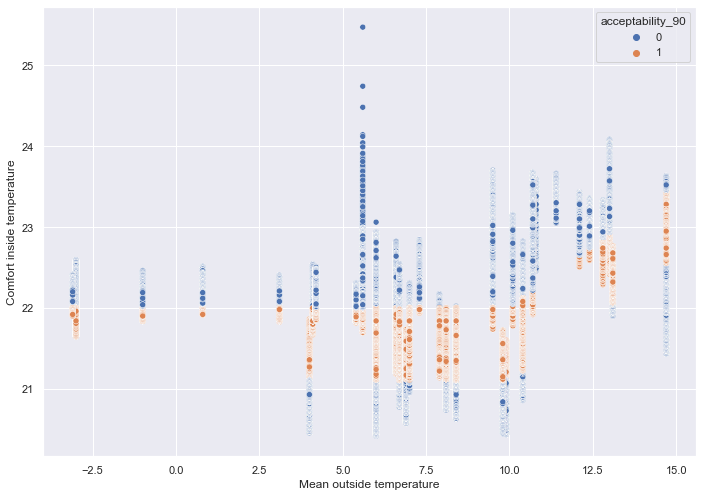
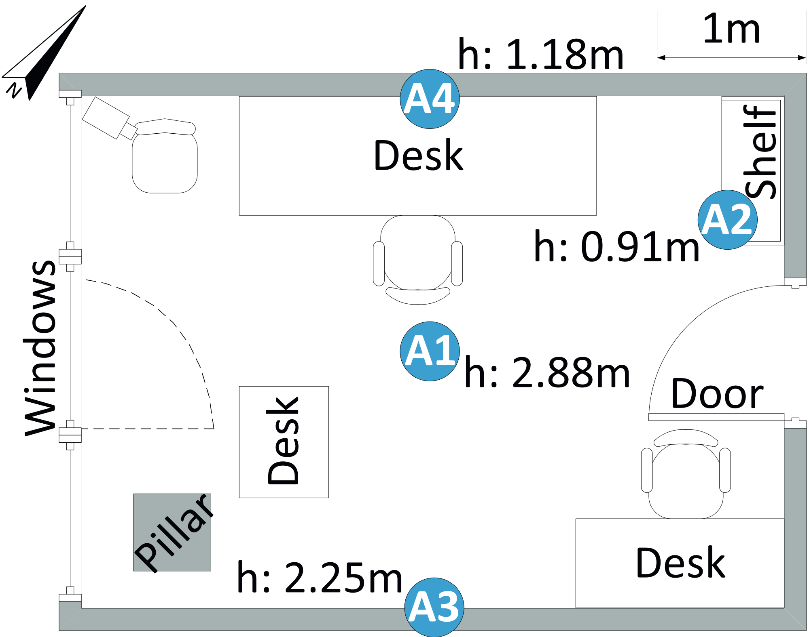
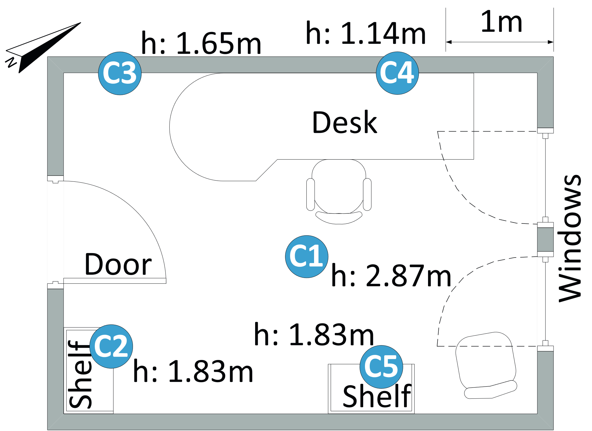

# ETL Notes

## requirements
Install the required packages (requirements.txt) \
The source datasets can be found at https://github.com/IoTsec/Room-Climate-Datasets \
Download those datasets and put them alongside the notebooks, the file structure should look as follows.

+ Dataset
    + datasets-location_A
    + datasets-location_B
    + datasets-location_C

For the updated pythermalcomfort package you have to install the following package.
````
pip install https://github.com/maartendonkersloot/pythermalcomfort/archive/master.zip
````
If you get the following error.
````
ImportError: Numba needs NumPy 1.20 or less
````
Do the following or your equivalent and restart your kernel.
````
conda install numpy<1.20 
````

## Column details
+ original_entry_id: Data is concatinated from multiple days/rooms, these are the original entry id's from those sources.
+ node_id: At what place in the room the data was collected from, [see floor plans section](#floor-plans) 
+ room: Which room was used, [see floor plans section](#floor-plans) 
+ absolute_time: Unix timestamp of reading
+ relative_time: The time between this and the previous reading
+ date: Date of reading
+ temperature: Temperature in Celsius
+ mean_temp_day: The mean temperature from the day of the reading in Mannheim Germany (place where the study took place)
+ heatindex: What the temperature feels like
+ relative_humidity: Percentage of humidity in the air
+ light_sensor_one_wavelength: Wavelength in nm at reading time
+ light_sensor_two_wavelength: Wavelength in nm at reading time
+ number_occupants: Amount of people in the room at the time of the reading
+ activity_occupants: Activity the occupants were doing at the time off the reading  (0 = n/a, 1 = read, 2 = stand, 3 = walk, 4 = work)
+ door_state: Was the door open or closed
+ window_state: was the window open or closed
+ tmp_cmf: Comfort temperature a that specific running mean temperature, in °C
+ tmp_cmf_80_low: Lower acceptable comfort temperature for 80% occupants, in °C
+ tmp_cmf_80_up: Upper acceptable comfort temperature for 80% occupants, in °C
+ tmp_cmf_90_low: Lower acceptable comfort temperature for 90% occupants, in °C
+ tmp_cmf_90_up: Upper acceptable comfort temperature for 90% occupants, in °C
+ acceptability_80: Acceptability for 80% occupants
+ acceptability_90: Acceptability for 90% occupants

## Note on the comfort data
Comfort data model based on the [ASHRAE 55 standard](https://www.researchgate.net/figure/ASHRAE-55-limits-for-thermal-Comfort-adapted-from-ASHRAE-55-2017_fig5_327597687), which is about the same as [pub 74](https://www.vabi.nl/wp-content/uploads/2016/02/Open-hier-Comforteisen-toetsen-met-gebouwsimulatie.pdf). 

## Acceptability 80% distribution


## Acceptability 90% distribution


<h2 id="floor-plans">Floor plans dataset</h2>
<h3>Room A</h3>

<h3>Room B</h3>

<h3>Room C</h3>


## sources
+ study used as datasource: https://github.com/IoTsec/Room-Climate-Datasets
