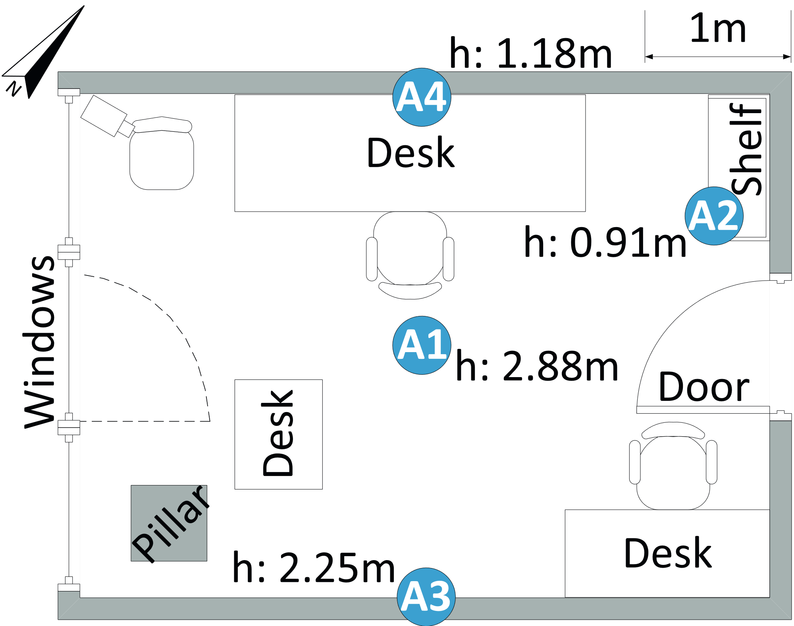

# ETL Notes

## Requirements
Install the required packages (requirements.txt) \
The source datasets can be found at https://github.com/IoTsec/Room-Climate-Datasets \
Download those datasets and put them alongside the notebooks, the file structure should look as follows.

+ Dataset
    + datasets-location_A
    + datasets-location_B
    + datasets-location_C

## What we want from our dataset
We decided early on in the project that we would need to combine climate data from sensors placed inside a room, office, classroom with some kind of human satisfaction data, active feedback or passive feedback. In this document we will justify on the dataset.

### climate data requirements
For the indoor-climate data we would ideally get the following features.

must haves

+ temperature
+ humidity

nice to haves

+ IAQ data(indoor air quality)
+ doorstate
+ windowstate
+ room(if we use multiple rooms)
+ historical data

### where would this data come from
Through our meetings we found out about a living lab(SENDlab) inside of Avans, after another follow-up meeting with Maurice Snoeren we came to the conclusion that the current SENDlab doesnt have satisfy our data requirements.

+ SENDlab isn't historical.
+ SENDlab doesn't have any humidity data.

The biggest of these is ofcourse the historical data, there isn't enough data in sendlab for a good prediction plus the data isn't consistently retrieved.

At the same time we were looking at the SENDlab we had various contact points with our stakeholders about getting data from one off them.
After our initial meeting we found out that strukton and Olivia Guerra potentially already have a datasource, after sending out more follow-up emails the week after to these stakeholders we've gotten no response.

Because off this non-communication and the poor quality of SENDlab we decided to mock our dataset and future-proof our project so the next group that will pick it up will only have to exchange our mock dataset for the real one.

### satisfaction data requirements
We need to find a way to get our satisfaction data for that we could either choose for active or passive feedback.
Early on Erik Kluijtmans found an existing study detailing that passive feedback isn't yet ready to accommodate individual differences in thermal comfort.

A qoute from the study.
>Current methods of evaluating thermal comfort in buildings are unable to accommodate individual 
differences in thermal sensations and preferences due to their “one size fits all” approach.

Thus we choose to use active feedback.
### our approach to active feedback
We started focusing our efforts to getting some kind of active feedback from the people inside the living lab. There are a couple ways to get this data.
+ Create an app where students can leave feedback about their comfort.
+ Use moodboxes that students press when leaving a room, rating the comfort for that class.

We deliberated both off these options and decided on using moodboxes.

Why we don't want to use an app.
1. An app could be used to answer whenever they want during class or more than once, making it less generalised over the entire class.
2. An app could be used as a complain-app more than for actual feedback.

Why we want to use moodboxes.
1. We specify when and where someone gives feedback(at the end of class when they walk out).
2. Avans has a past record of using moodboxes so they could already be available to us.

### getting the moodboxes.
We then started contacting concerned party at Avans who would know about these buttons. Through this we found out that the moodbox-campaign wasn't done by Avans itself but by a third party.

To follow up on this discovery we contacted this third party about potentially getting one or more moodboxes from them, we got a reply to our first email that they'd start looking, we haven't gotten any follow up email about this, nor did we get a reply to our follow up email.

We also discussed the moodbox idea in the stakeholder meeting. There is potentially a space for us at strukton where we could place said buttons but getting the required compliance from strukton would take too long for our turn-around time.
## Why we dont use b4bux specific dataset
This basically left us without any real climate data or feedback data which is when we looked at some already existing comfort standards specifcally ([ASHRAE 55 standard](https://www.researchgate.net/figure/ASHRAE-55-limits-for-thermal-Comfort-adapted-from-ASHRAE-55-2017_fig5_327597687) and [publication 74](https://www.vabi.nl/wp-content/uploads/2016/02/Open-hier-Comforteisen-toetsen-met-gebouwsimulatie.pdf).

## ASHRAE 55 standard
First off all the ASHREA 55 standard can be found [Here](https://ashrae.iwrapper.com/ASHRAE_PREVIEW_ONLY_STANDARDS/STD_55_2020) in case you need more details. For our project specifically we want our focus on page 20 which details the acceptability limits for comfort.

To calculate our satisfaction limits with the ASHRAE 55 standard we need 3 variables page 20 off the standard, we will go more into detail about this calculation here.

+ The prevailing mean outdoor air temperature from the last 7 days. 
+ Air temperature.
+ Humidity.

### Extra note on humidity
Our tutor mentioned that humidity might not be a good factor to determine satisfaction, we would like to refute this by pointing to page 49 off the standard which describes.

>Nonthermal comfort factors, such as skind drying, irritation, dryness of the eyes and static electricity generation may place limits on acceptability in a low humidity environment.

The humidity itself does directly corrolate to satisfaction because of this, the thermal comfort may be perfect but if the humidity gives you dry eyes you wouldn't be comfortable.

### Calculation
To calculate this satisfaction the standard specifies the acceptability limits, if someone falls within this upper and lower limit then they are satisfied.

The limit for 80% comfort is A thermal environment that a substantial majority(more than 80%) of the occupants find thermally acceptable. 

Tpmaout is the prevailing mean outside temperature.

Upper limit 80% comfort = (0.31 * tpmaout) + 21.3 \
Lower limit 80% comfort = (0.31 * tpmaout) + 14.3 

*Calculation comfort limits*  

This is the limit that determines where the lines are drawn on the ASHRAE 55 graph.
You then plot your mean outside temperature and inside temperature to define if someone falls between these limits, if they do then they're comfortable. 

*Ashrae 55 adaptive model graph*  

## Used climate dataset explenation
When we determined that we couldn't get our own data we started looking for already existing studies which would satisfy our climate data requirements.
We found two potential sources for our data from previous studies.
+ [Appliances energy prediction Data Set](https://archive.ics.uci.edu/ml/datasets/Appliances+energy+prediction) 
+ [Room climate dataset](https://github.com/IoTsec/Room-Climate-Datasets)

After assassing both datasets we found that the features off the room climate dataset better align with our data requirements. 
We will use this as a dataset for our climate data to prove our hypothese. 
## Human-satisfaction mock data creation
Now that we have our dataset and our mock creation standard we have to apply the ASHRAE55 standard on it to get our satisfaction data.
To do this we looked around for an already existing package so we don't have to implement the entire standard ourselves. 
We found this package [Pythermalcomfort](https://pypi.org/project/pythermalcomfort/) which implements a bunch of thermal comfort standards, including the adpative model we will use.

We combined this package and the climate dataset to create the acceptability_80% feature for our dataset. The code for this can be found [here](https://github.com/AvansETI/SmartGridAI/blob/b4bux/development/B4B%20Human%20Wellbeing%20Prediction/data_gathering/transform.ipynb).

## Pros and cons of using a mock dataset

cons

+ Its not reflective off the real situation at avans.
+ Biasisms off the original study reflecting on this one.
+ Extra project time spent on making it easily exchangable.

pros

+ Mocking our own data gaurantees that a pattern will be found.

## Result
The result of all this is our own mock dataset that meets our data requirements.
The code for extracting the climate data can be found [here](https://github.com/AvansETI/SmartGridAI/blob/b4bux/development/B4B%20Human%20Wellbeing%20Prediction/data_gathering/extract.ipynb).
The code for transforming the climate data to include satisfaction data can be found [Here](https://github.com/AvansETI/SmartGridAI/blob/b4bux/development/B4B%20Human%20Wellbeing%20Prediction/data_gathering/transform.ipynb).
The resulting dataset can be found [Here](https://github.com/AvansETI/SmartGridAI/blob/b4bux/development/B4B%20Human%20Wellbeing%20Prediction/datasets/dataset.csv).

### Column details
+ original_entry_id: Data is concatinated from multiple days/rooms, these are the original entry id's from those sources
+ node_id: At what place in the room the data was collected from, [see floor plans section](#floor-plans) 
+ room: Which room was used, [see floor plans section](#floor-plans) 
+ absolute_time: Unix timestamp of reading
+ relative_time: The time between this and the previous reading
+ date: Date of reading
+ temperature: Temperature in Celsius
+ mean_temp_day: The mean temperature from the day of the reading in Mannheim Germany (place where the study took place)
+ heatindex: What the temperature feels like
+ relative_humidity: Percentage of humidity in the air
+ light_sensor_one_wavelength: Wavelength in nm at reading time
+ light_sensor_two_wavelength: Wavelength in nm at reading time
+ number_occupants: Amount of people in the room at the time of the reading
+ activity_occupants: Activity the occupants were doing at the time off the reading  (0 = n/a, 1 = read, 2 = stand, 3 = walk, 4 = work)
+ door_state: Was the door open or closed
+ window_state: was the window open or closed
+ tmp_cmf: Comfort temperature a that specific running mean temperature, in °C
+ tmp_cmf_80_low: Lower acceptable comfort limit for 80% occupants, in °C
+ tmp_cmf_80_up: Upper acceptable comfort limit for 80% occupants, in °C
+ tmp_cmf_90_low: Lower acceptable comfort limit for 90% occupants, in °C
+ tmp_cmf_90_up: Upper acceptable comfort limit for 90% occupants, in °C
+ acceptability_80: Acceptability for 80% occupants
+ acceptability_90: Acceptability for 90% occupants

# Figures
## Acceptability 80% distribution

*Acceptability 80% distribution in our dataset* 

## Acceptability 90% distribution

*Acceptability 90% distribution in our dataset* 

<h2 id="floor-plans">Floor plans dataset</h2>
<h3>Room A</h3>

<h3>Room B</h3>

<h3>Room C</h3>

## Sources
+ Study used as datasource: https://github.com/IoTsec/Room-Climate-Datasets
