# Influxdb
Het plan was om de data, zowel de voorspellings als de daadwerkelijke data, in een overzichtelijk dashboard weer te geven voor de gebruiker. Dit zouden we doen d.m.v. InfluxDB als onze data source. InfluxDB is een database die gemaakt is voor “Time series based data” waarmee de data als hoofdpunt de tijd gebruikt om de waardes te laten zien. Wij zijn erachter gekomen dat InfluxDB totaal niet Plug & Play is. Er is veel documentatie maar hier heb je in werkelijkheid niet altijd veel aan. Het is veel gepuzzel, maar er is een voordeel nu. Wij hebben namelijk al dit gepuzzel voor je gedaan.

[Link naar InfluxDB](http://localhost:8086/)

# Grafana
Om de data te laten zien in een overzichtelijk dashboard, willen we Grafana te gebruiken. De reden waarom we voor grafana hebben gekozen is omdat Grafana de mogelijkheid biedt om samen te werken met InfluxDB en een goedwerkende interface heeft van het verbinden van InfluxDB tot het weergeven van de data in het dashboard.
We hebben hier met twee personen veel tijd aan moeten besteden om dit werkend te krijgen. Het is om exact deze reden dat we een eigen stap-voor-stap uitlegsdocument wilde maken met onze stappen om dit werkend te kunnen krijgen. Als het goed is heb je een .csv bestand met data gekregen, als dit het geval is kun je deze korte uitleg volgen om je data te kunnen gaan gebruiken in Grafana. 

[Link naar Grafana](http://localhost:3000/)

# Stappen
De stappen zijn als volgt: 
1.	Datetime naar nanoseconds
2.	.txt bestand omzetten naar Unix bestand
3.	Data Query maken
4.	InfluxDB gaan importeren in Grafana

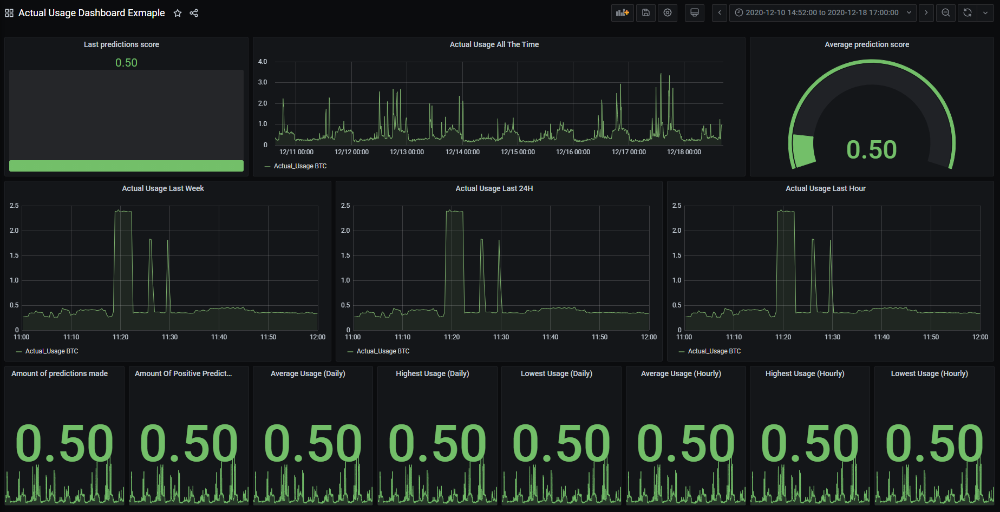

Voorbeeld van ons eerst werkende Grafana Dashboard. 


### 1.	Datetime naar nanoseconds
Bij het inladen van de data kregen we in het begin veel problemen; met inladen kregen we vooral erg veel de error: ‘Bad Timestamp’ waardoor de data niet ingeladen kon worden. Blijkbaar heeft InfluxDB een andere format van date timestamps. De timestamps die wij gewend zijn is ‘2020-12-10T12:55:45.758Z’.  Maar het probleem is dat InfluxDB de timestamps aangeeft als nanoseconds. Het is daarom dat wij hebben besloten een Jupyter Notebook file op te stellen die het mogelijk maakt om de data om te zetten naar nanoseconds en vervolgens dit op te slaan als een nieuwe .txt bestand. Door dit script was het mogelijk om onze data in te voeren. 
Wellicht is het handig om in de toekomst te kijken of het mogelijk is de data timestamps van begin af aan om te zetten naar nanoseconds.

### 2.	.txt bestand omzetten naar Unix bestand
Nadat de data door de Jupyter Notebook is gehaald houden we een .txt bestand over. Met het uploaden van het bestand naar influxDB liep heel het systeem vast. Nadat we erachter kwamen wat de error was bleek het te gaan over een conversie probleem; Het bestand dat we krijgen vanuit de Notebook heeft als opbouw ‘Windows CR LF’. Dit betekent dat zodra we het bestand uploaden naar InfluxDB worden alle tekstregels achter elkaar geplakt tot 1 regel. InfluxDB eist als opmaak onder andere dat elke nieuwe regel een nieuwe data item is.  Om dit te verhelpen hebben we het bestandformaat ‘Unix LF’. Dit zorgt ervoor dat elke nieuwe regel wordt gezien als een nieuwe Data Item.  Op deze manier kunnen we onze data inladen via een bestand in plaats van alles handmatig aan te moeten gaan passen. 
Het omzetten zelf hebben we gedaan via Notepad++. We hebben ons .txt bestand van Jupyter Notebook ingeladen in Notepad++ en het via hier opgeslagen als ‘Unix LF’. We hebben geen onderzoek gedaan of er een mogelijkheid is om het bestand automatisch om te zetten naar een Unix LF bestand. Dit zou wellicht wel kunnen bestaan.

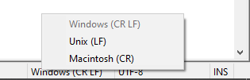

Selecteer hierbij "Unix (LF)".


### 3.	Inladen van data in InfluxDB
Het is eerst nodig om InfluxDB te installeren op je toestel. Zodra dit gelukt is is dit het eerste scherm dat je ziet binnen InfluxDB. 

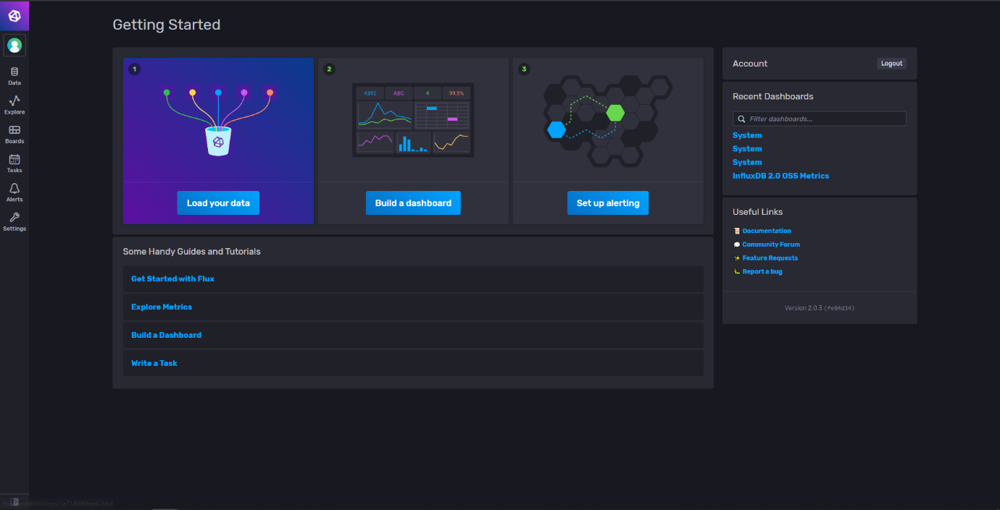

Dit is hoe de beginpagina van InfluxDB (GUI versie) eruit ziet.


1)	Op het bovenstaand plaatje ziet u de homepagina van InfluxDB als deze aan het runnen is op je systeem. 

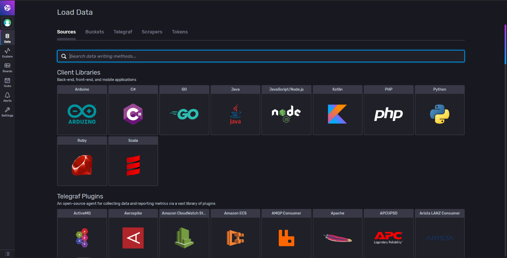

Hier kan de gebruiker verschillende soorten pre-installed plugins selecteren. Voor nu, hebben wij besloten om voor een bucket te gaan.


2)	Als je links bovenin op het tabblad Data drukt kom je uit bij een overzicht van alle mogelijke libraries en plugins. Hier moet je bovenin naar het tabblad ‘Buckets’ gaan. 

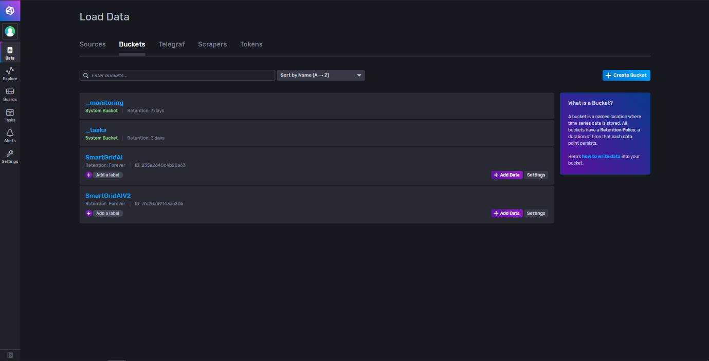

Hier wordt een overzicht van de buckets weergeven.

3)	Klik rechtsbovenin op ‘Create Bucket’ en geef vervolgens de bucket een naam. 

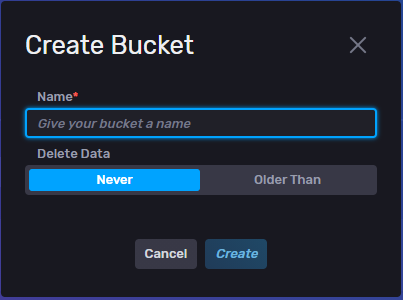

Dit is de pop-up die InfluxDB geeft zodra er een bucket wordt aangemakt.


4)	Vervolgens klik je bij de lijst van buckets op ‘Add Data’.

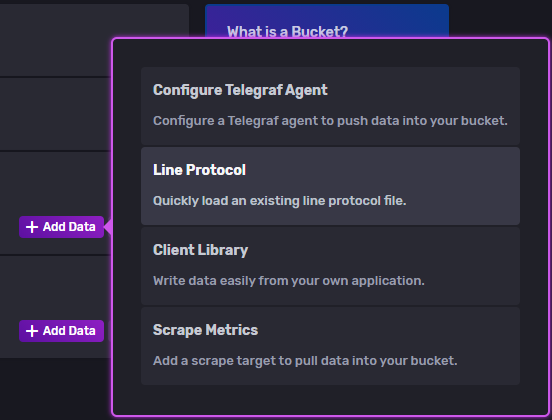

Kies hierbij voor "Line Protocol" zodat we een bestand met codering kunnen gebruiken voor het importeren van de data.


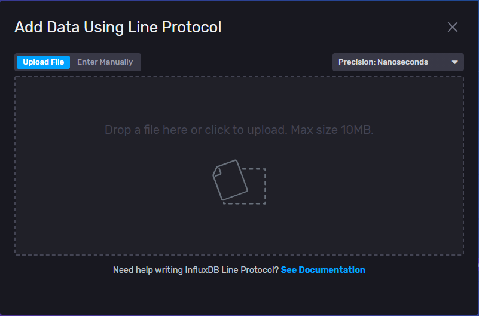

Sleep hierin het bestand of klik op het icoontje om een bestand te selecteren.

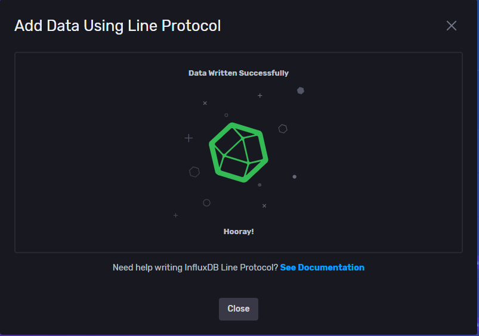

Klik daarna op het importeren en indien het gelukt, krijg je dit scherm te zien.


5)	Bij deze laatste stap moet je je data uploaden. Als dit succesvol is zie je dit scherm met ‘Data Written Succesfully’. Dit lijkt makkelijk toch? Het inladen zelf stelt niet veel voor, maar je moet eerst weten hoe je data gestructureert moet zijn voordat InfluxDB dit accepteert. 

### 4. Data query maken
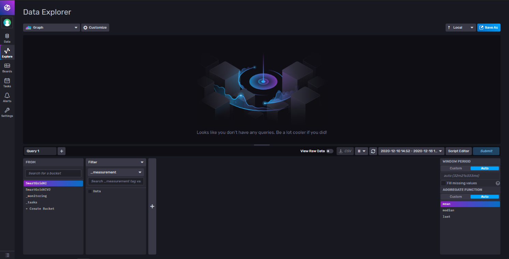
Dit is hoe het overizicht eruit ziet van het verkennen van de data.


Zodra de data succesvol is ingevoerd ga je naar de Data Explorer door links bovenin op het tabje ‘Explore’ te drukken. Vanuit hier kun je Data Queries maken via twee manieren: Via een script editor en een query builder.  Alles dat je maakt in de query builder kan teruggezien worden in codering via de script editor knop. 
Alles dat je doet in de query builder wordt weergegeven in de script editor als codering. We hadden in de script editor de volgende code ingevoerd dat werkte:

```sql
    from(bucket: "SmartGridAI")
      |> range(start: v.timeRangeStart, stop: v.timeRangeStop)
      |> filter(fn: (r) => r["_measurement"] == "Data")
      |> filter(fn: (r) => r["_field"] == "Actual_Usage")
      |> aggregateWindow(every: v.windowPeriod, fn: mean, createEmpty: false)
      |> yield(name: "mean")
```

Onze bucket heet SmartGridAI. Als je gebruik maakt van een andere bucket moet je hier uiteraard de bucketnaam pakken van je eigen bucket. Als je hier op Submit drukt krijg je als het goed is een weergave van je data (zie onderstaande afbeelding). De codering die je maakt in InfluxDB kan ook gebruikt worden in Grafana. Hier komt later in dit document nog meer informatie over.

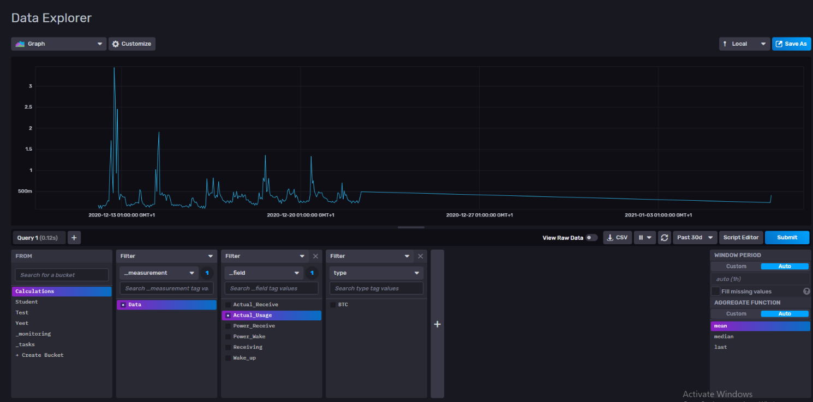

Dit is het resultaat van de codering.


### 5.	Grafana
Grafana heeft een zeer fijne interface om mee te werken, zelfs voor gebruikers die weinig tot geen ervaring hebben met grafana.  Voor ons biedt Grafana de mogelijkheid om onze voorspellingen en de daadwerkelijke data in een overzichte dashboard weer te geven.
Binnen Grafana gaan we het over meerdere dingen hebben. We hebben dit daarom verdeeld in meerdere stappen. 
1.	Data source toevoegen
2.	Dashboard aanmaken
    2.1 Paneel toevoegen
    2.2 Query toevoegen
    2.3 Paneel toevoegen/verwijderen
    
#### 1.	Data source toevoegen
Voor dat je data kan weergeven in een dashboard, moet de data worden toegevoegd. Om een data source toe te voegen aan Grafana worden de volgende stappen ondernomen:

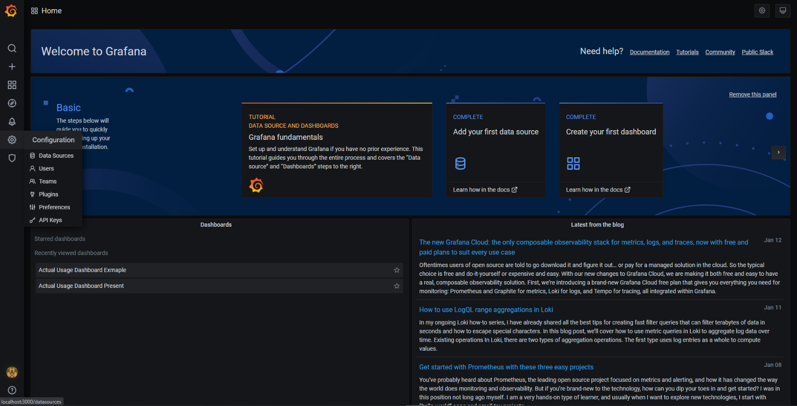

Zo ziet de beginpagina van Grafana er uit.


Vanuit het welkom scherm van Grafan, beweeg de cursor op "gearbox icoontje" en klik vervolgens op “Data Sources”

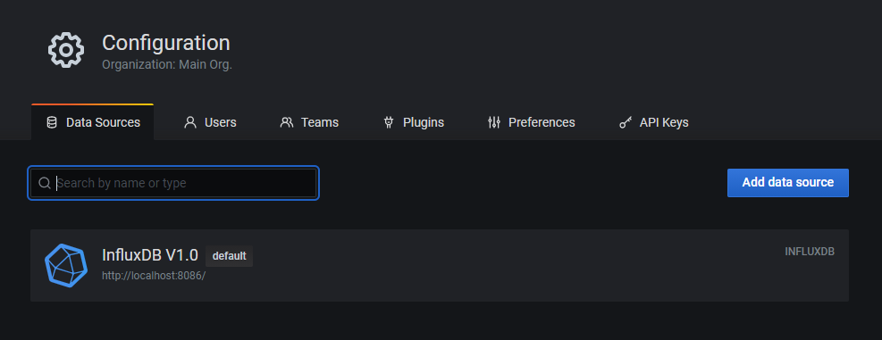

Hier kan de gebruiker de verschillende verbindingen zien.


Vanuit hier kan de gebruiker een data source toevoegen door op de knop “Add data source” te klikken.

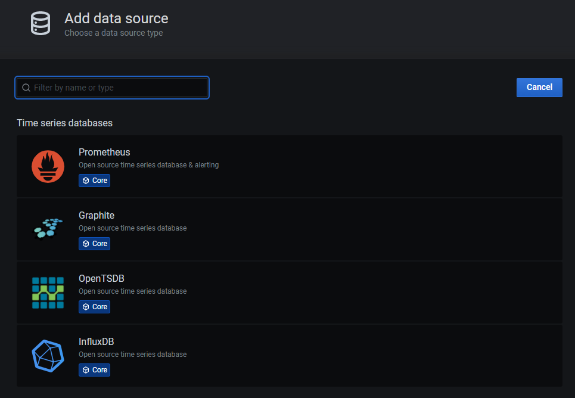

Hier kan de gebruiker de verschillende time series databases selecteren die ondersteund worden door Grafana.


Vervolgens selecteert de gebruiker de database vanuit de gewenste categorie. In ons geval is dit InfluxDB.

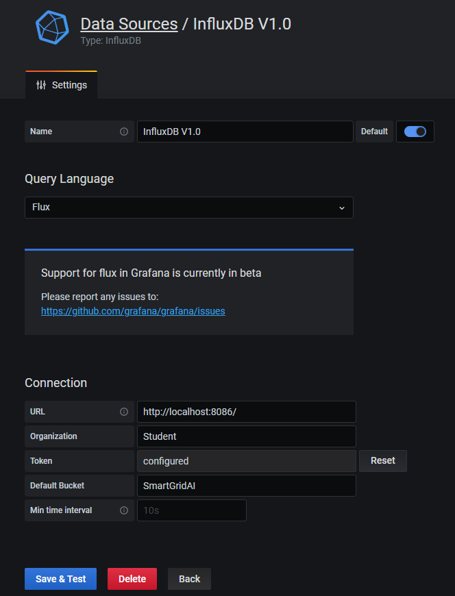

De instellingen voor de verbinding met InfluxDB.


Vanuit hier kan je kiezen op welke manier je de data wilt ophalen. Wij hebben besloten voor Flux omdat we dan de query’s op kunnen zetten via InfluxDB.

#### 2.	Dashboard aanmaken
Zodra de data source is aangemaakt en getest is op de verbinding, is het tijd om een dashboard aan te maken. Om een dashboard aan te maken worden de volgende stappen ondernomen:

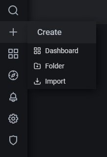

De gebruiker beweegt de muis over "+" en kllikt op “Dashboard”. Vanuit hier heeft de gebruiker een nieuw dashboard aangemaakt waarin er panelen kunnen toegevoegd worden.


##### 2.1	 Paneel Toevoegen
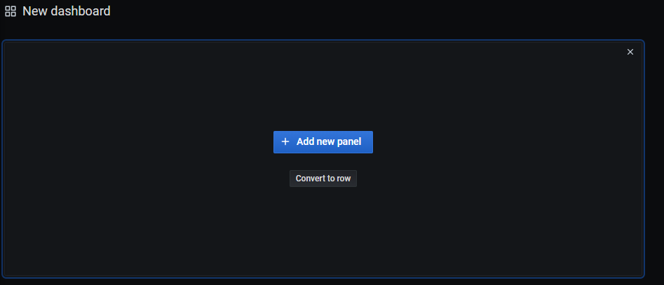

Zodra de gebruiker een dashboard heeft aangemaakt, kan de gebruiker een paneel toe voegen door op “Add new panel” te klikken. Vanuit hier kan de gebruiker aangeven wat voor een paneel het wordt.

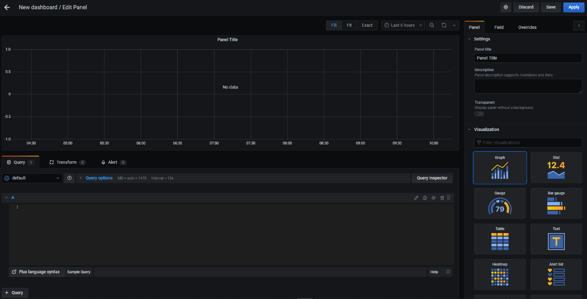

In dit paneel kan de gebruiker aangeven hoe de data visueel weergeven wordt. Dit kan gewijzigd worden onder de categorie “Visualization”. Vanuit hier kan de gebruiker verschillende type panelen selecteren voor gebruik.


##### 2.2	 Query toevoegen
Om data op te halen via Grafana uit InfluxDB, kan de gebruiker een query schrijven in de query editor.

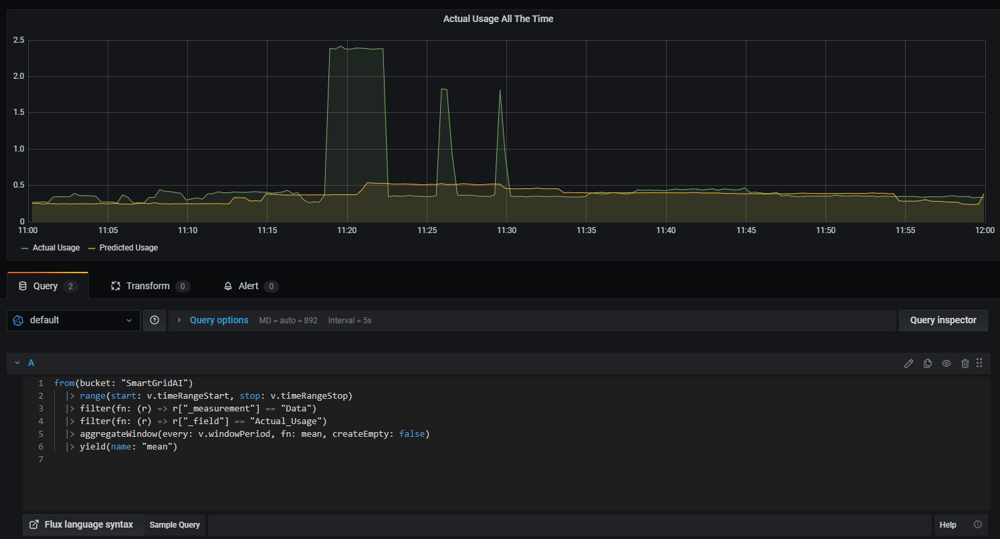

Zodra de gebruiker een query heeft geschreven wordt het resultaat van de query weergegeven in het bovenstaande paneel.


##### 2.3 Paneel toevoegen/verwijderen
Indien een paneel gewijzigd/verwijderd moet worden, kan de gebruiker op de titel van het paneel klikken en vanuit hier aangeven welke actie er ondernomen moet worden met het paneel.

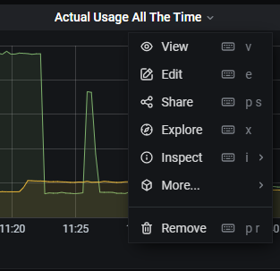